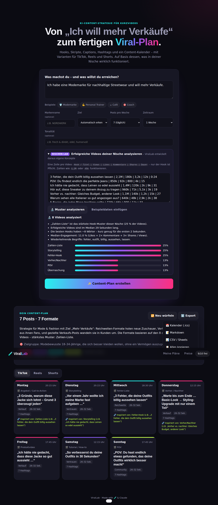
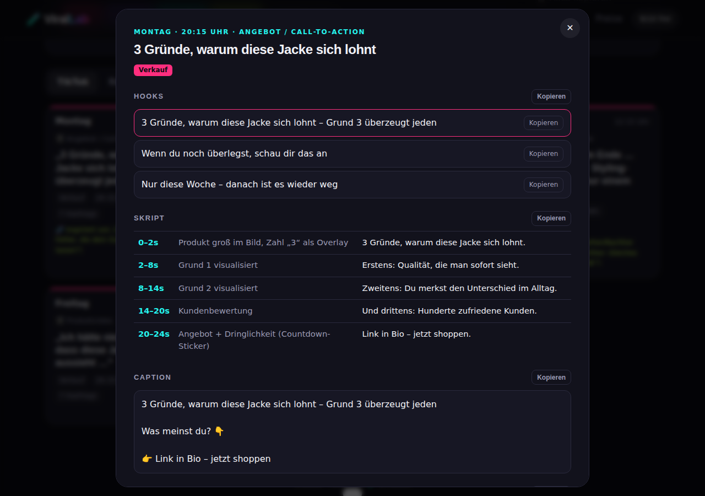

# 🧪 ViralLab – KI für TikTok-, Reels- & Shorts-Ideen

> Du schreibst: **„Ich habe eine Modemarke und will mehr Verkäufe.“**
> ViralLab liefert: einen kompletten Content-Plan mit Hooks, Skripten, Captions, Hashtags, Kalender und Varianten pro Plattform.

```
Montag     🎬 „3 Fehler, die deine Outfits billig aussehen lassen“
Dienstag   🎬 Produktvideo – Hook: „Ich hätte nie gedacht, dass diese Jacke so gut aussieht …“
Mittwoch   🎬 Storytelling – „Vor einem Jahr wollte ich meine Marke fast aufgeben …“
Donnerstag 🎬 Vorher / Nachher
Freitag    🎬 Tutorial / How-to
…
```



## Features

| | |
|---|---|
| 🎣 **Hooks** | 3 Varianten pro Post, die stärkste zuerst |
| 🎬 **Skripte** | Szene für Szene mit Zeitfenster, Bild und Voiceover |
| ✍️ **Captions & Hashtags** | Mit Call-to-Action passend zum Ziel (Verkauf, Leads, Reichweite, Marke) |
| 📅 **Content-Kalender** | 3–7 Posts/Woche, 1–4 Wochen, mit Uhrzeiten, Export als `.ics`, Markdown oder CSV |
| 📱 **Plattform-Varianten** | TikTok, Instagram Reels und YouTube Shorts mit eigener Länge, eigenem Overlay und eigenem CTA |
| 🔬 **Nischen-Lab** | Analysiert erfolgreiche Videos deiner Nische (Hook-Muster, Länge, Engagement, Keywords) und entwickelt daraus **neue, eigene** Konzepte, statt Videos zu kopieren |
| 🧱 **Content-Säulen** | Mix aus Reichweite, Vertrauen, Community und Verkauf |
| ⚙️ **Viele Optionen** | Branche, Ziel, Rhythmus, Plattformen, Tonalität, Videolänge, Kamera, Call-to-Action, Emojis, Hashtags, Zielgruppe und Formate. Die Einstellungen bleiben gespeichert. |
| 🗂 **Verlauf** | Alle Pläne werden gespeichert und lassen sich wieder öffnen |



## Auswahlmöglichkeiten

| Option | Auswahl |
|---|---|
| **Branche** | Automatisch, Mode, Fitness, Gastronomie, Beauty, Coaching, Tech, Immobilien, Handwerk, Gesundheit & Praxis, Reisen & Hotel, Bildung & Nachhilfe, Haustiere, Auto & Werkstatt, Andere |
| **Ziel** | Mehr Verkäufe, Anfragen/Leads, Reichweite, Stärkere Marke, Produkt-Launch, Mehr Besucher vor Ort, Mehr Engagement, Mitarbeiter finden |
| **Rhythmus** | 1–7 Posts pro Woche, 1–4 Wochen |
| **Plattformen** | TikTok, Instagram Reels, YouTube Shorts (beliebig kombinierbar) |
| **Tonalität** | Locker & frech, Professionell, Humorvoll, Inspirierend, Edel & minimalistisch, Ehrlich & nahbar, Mutig & polarisierend, Lehrreich, dazu eigene Wünsche als Freitext |
| **Videolänge** | Kurz (7–15 Sek.), Mittel (15–30 Sek.), Lang (30–60 Sek.), Gemischt |
| **Vor der Kamera** | Mit Gesicht, ohne Gesicht (faceless), gemischt |
| **Call-to-Action** | Link in Bio, DM, Kommentieren, Website, Vorbeikommen/Termin, Folgen, Speichern & teilen |
| **Emojis / Hashtags** | Viele, wenige oder keine Emojis; 3, 5, 8 oder 12 Hashtags |
| **Formate** | Fehler-Liste, Produktvideo, Storytelling, Tutorial, POV, Mythos, Behind the Scenes, Vorher/Nachher, Kommentar-Antwort, Angebot (einzeln an- und abwählbar) |

## Wie das Nischen-Lab funktioniert

Füge erfolgreiche Videos ein, eins pro Zeile (nur der Hook ist Pflicht):

```
3 Fehler, die dein Outfit billig aussehen lassen | 2,1M | 180k | 3,2k | 12k | 0:24
POV: Du findest endlich die perfekte Jeans       | 850k | 92k  | 800  | 4k  | 15
```

`Hook | Views | Likes | Kommentare | Shares | Dauer`, Zahlen wie `1,2M`, `45k` oder `120.000` werden erkannt.

ViralLab
1. ordnet jeden Hook Mustern zu (Fehler-Hook, Zahlen-Liste, POV, Frage, Geheimnis, Vorher/Nachher, Storytelling, Überraschung, Kontroverse, How-to),
2. gewichtet die Muster nach Views und Engagement (`Likes + 2×Kommentare + 3×Shares / Views`),
3. leitet daraus Erkenntnisse ab (Median-Länge, Hook-Länge, Keywords),
4. baut die stärksten Muster in **neue** Konzepte für dein Business ein. Jeder Post zeigt unter „🧬 Inspiriert von“, welche Vorlage dahintersteckt.

## Monetarisierung

| Free | Pro |
|---|---|
| **10 Generierungen** | **9,99 €/Monat**, unbegrenzt |

- Nutzer werden über ein signiertes, anonymes Cookie erkannt, eine Registrierung ist nicht nötig.
- **Stripe Payment Link (Standard):** „Zahlungspflichtig abonnieren“ führt zum Zahlungslink (`STRIPE_PAYMENT_LINK`, im Code ist ein Test-Link hinterlegt). Die App hängt die Nutzer-ID als `client_reference_id` an. Nach der Zahlung schaltet der Webhook `checkout.session.completed` Pro frei. Ein API-Schlüssel ist dafür nicht nötig.
- **Stripe Checkout über die API:** Setz `STRIPE_PAYMENT_LINK=` leer und `STRIPE_SECRET_KEY`. Dann erzeugt die App die Checkout-Seite selbst. Kündigungen über den Kündigungsbutton laufen damit vollautomatisch.
- **Demo-Modus:** Ohne Link und ohne Schlüssel wird Pro 30 Tage kostenlos freigeschaltet. So lässt sich der Ablauf lokal testen.

## Schnellstart

```bash
npm install
cp .env.example .env    # optional
npm start               # http://localhost:3000
```

- **Ohne API-Key** erzeugt die eingebaute Offline-Engine Pläne aus 10 handgeschriebenen Viral-Formaten und 7 Branchenprofilen (Mode, Fitness, Food, Beauty, Coaching, Tech, Immobilien).
- **Mit `ANTHROPIC_API_KEY`** schreibt Claude (`claude-opus-5-5`, Structured Outputs) individuelle Pläne. Schlägt der Aufruf fehl, springt automatisch die Offline-Engine ein.

Für Umgebungsvariablen mit Node 20+: `node --env-file=.env server.js`

### Stripe einrichten

**Mit Payment Link** (einfachste Variante):
1. In Stripe den Zahlungslink öffnen → **Nach der Zahlung** → „Kunden auf eure Website weiterleiten“ → `https://<deine-domain>/?checkout=pending`
2. **Webhook** anlegen: `https://<deine-domain>/api/billing/webhook` mit den Events `checkout.session.completed` und `customer.subscription.deleted`. Das Secret als `STRIPE_WEBHOOK_SECRET` setzen. **Ohne Webhook wird Pro nach der Zahlung nicht freigeschaltet.**
3. Optional das No-Code-Kundenportal aktivieren (Einstellungen → Billing → Kundenportal) und den Login-Link als `STRIPE_PORTAL_URL` setzen.
4. Für echte Zahlungen den Live-Link als `STRIPE_PAYMENT_LINK` eintragen. Kündigungen über den Kündigungsbutton musst du in diesem Modus im Stripe-Dashboard ausführen, du bekommst sie per Log bzw. E-Mail. Mit zusätzlichem `STRIPE_SECRET_KEY` passiert das automatisch.

**Mit API-Checkout:**

1. `STRIPE_SECRET_KEY` setzen. Optional `STRIPE_PRICE_ID` für einen festen 9,99-€-Monatspreis, sonst wird der Preis inline angelegt.
2. Einen Webhook auf `https://<deine-domain>/api/billing/webhook` mit den Events `checkout.session.completed` und `customer.subscription.deleted` anlegen und das Secret als `STRIPE_WEBHOOK_SECRET` setzen.
3. `PUBLIC_URL` auf die öffentliche URL setzen.

## 🚀 Online stellen (Deployment)

Die App ist ein einzelner Node-Server mit Dockerfile. Ein Volume speichert Nutzer, Kontingente und Pläne. Es eignet sich jeder Hoster, der Docker und ein persistentes Volume anbietet.

### Option A: Render (am einfachsten)

[](https://render.com/deploy?repo=https://github.com/y4d8vszvyg-cyber/ViralLab)

1. Klick auf den Button oder geh in Render auf **New → Blueprint** und wähle dieses Repo. Render liest `render.yaml` und legt Dienst, Disk und `SESSION_SECRET` automatisch an.
2. Beim Anlegen trägst du ein:
   - `ANTHROPIC_API_KEY` für Claude-generierte Pläne (leer lassen = Offline-Engine)
   - `PUBLIC_URL`, z.B. `https://virallab.onrender.com`
   - `STRIPE_SECRET_KEY` und `STRIPE_WEBHOOK_SECRET`, siehe unten
3. Nach etwa 2 Minuten ist die App unter `https://<name>.onrender.com` erreichbar. Eine eigene Domain lässt sich unter **Settings → Custom Domains** hinzufügen.

> Für die persistente Disk braucht Render den „Starter“-Plan (ca. 7 $/Monat). Auf dem Gratis-Plan gehen gespeicherte Daten bei jedem Neustart verloren.

### Option B: Fly.io (Server in Frankfurt)

```bash
fly launch --copy-config --no-deploy
fly volumes create virallab_data --size 1 --region fra
fly secrets set SESSION_SECRET=$(openssl rand -hex 32) ANTHROPIC_API_KEY=sk-ant-... PUBLIC_URL=https://virallab.fly.dev
fly deploy
```

### Option C: Railway oder ein eigener Server

Das `Dockerfile` baut die Image. Mount ein Volume auf `/data` und setz `SESSION_SECRET` sowie optional die übrigen Variablen aus `.env.example`. Auf einem eigenen Server reicht:

```bash
docker build -t virallab .
docker run -d -p 80:3000 -v virallab-data:/data -e SESSION_SECRET=$(openssl rand -hex 32) virallab
```

### Checkliste vor dem Livegang

- [ ] `SESSION_SECRET` ist gesetzt. Ohne den Wert startet die App in Produktion absichtlich nicht.
- [ ] `PUBLIC_URL` zeigt auf die echte Domain, sonst stimmen die Stripe-Weiterleitungen nicht.
- [ ] Stripe ist eingerichtet. Ohne Stripe ist der Demo-Modus aktiv, und **jeder kann Pro gratis freischalten**. Alternativ `ALLOW_DEMO_UPGRADE=false` setzen.
- [ ] Der Stripe-Webhook zeigt auf `https://<domain>/api/billing/webhook`.
- [ ] `LEGAL_NAME`, `LEGAL_ADDRESS` und `LEGAL_EMAIL` sind gesetzt. Solange sie fehlen, zeigen die Rechtsseiten einen Warnhinweis.
- [ ] Der E-Mail-Versand (`RESEND_API_KEY`, `MAIL_FROM`) ist eingerichtet, damit Kündigungen automatisch in Textform bestätigt werden.
- [ ] Die Rechtstexte sind von einer Fachperson geprüft. Es sind Vorlagen, keine Rechtsberatung.

Der Health-Check läuft unter `GET /healthz`. CI (GitHub Actions) führt bei jedem Push die Tests und den Docker-Build aus.

## ⚖️ Rechtliches (Deutschland)

| Seite | Inhalt |
|---|---|
| `/impressum` | Angaben nach § 5 DDG |
| `/datenschutz` | Hosting, Cookie, KI-Verarbeitung (Anthropic), Zahlungen (Stripe), Rechte |
| `/agb` | Leistungen, Laufzeit, Kündigung, Nutzungsrechte, Haftung |
| `/widerruf` | Widerrufsbelehrung mit Muster-Formular |
| `/kuendigen` | **Kündigungsbutton** nach § 312k BGB |

- Die Betreiberangaben kommen aus Umgebungsvariablen (`LEGAL_*`, siehe `.env.example`). Du musst also keinen Code ändern.
- **Checkout:** Vor dem Abo muss der Kunde den AGB zustimmen und den sofortigen Leistungsbeginn vor Ablauf der Widerrufsfrist bestätigen.
- **Kündigung:** Die Seite kündigt das Stripe-Abo zum Ende des Abrechnungszeitraums. Gefunden wird es über den Browser des Kunden oder über die E-Mail-Adresse bei Stripe. Der Kunde sieht sofort eine Bestätigung mit Eingangszeit. Ist Resend eingerichtet, bekommt er sie zusätzlich per E-Mail, mit Kopie an `LEGAL_EMAIL`.
  - Ohne E-Mail-Versand landen Kündigungen in `data/db.json` und im Server-Log. Die Bestätigung musst du dann selbst per E-Mail schicken.
- **Abo verwalten:** Pro-Kunden öffnen über die Preis-Ansicht das Stripe-Kundenportal für Rechnungen, Zahlungsmethode und Kündigung.
- **Schriften:** Sie werden vom eigenen Server geladen, es gehen keine Anfragen an Google.

## Tests

```bash
npm test
```

Getestet werden Analyzer, Engine, Exporte, das Free-Limit inklusive 402-Paywall, das Pro-Upgrade, die Trennung der Pläne zwischen Nutzern und die Prüfung der Stripe-Webhook-Signatur.

## Architektur

```
server.js            Express-API (Generierung, Analyse, Pläne, Billing)
src/analyzer.js      Nischen-Analyse: Parsing, Hook-Muster, Engagement, Insights
src/engine.js        Offline-Content-Engine (Formate, Kalender, Varianten)
src/industries.js    Branchenprofile & Zielerkennung
src/options.js       Wählbare Optionen (Tonalität, Länge, CTA …)
src/catalog.js       Options-Katalog fürs Frontend
scripts/build-demo.mjs  Baut eine Browser-only-Demo (dist/virallab-demo.html)
src/ai.js            Claude-Integration mit Structured Output + Fallback
src/schema.js        Zod-Schema eines Content-Plans
src/store.js         JSON-Datei-Store (Nutzer, Kontingente, Pläne)
src/billing.js       Stripe Checkout, Portal, Webhook-Verifikation
public/              Frontend (Vanilla JS, ohne Build-Schritt)
```

## API

| Methode | Pfad | Beschreibung |
|---|---|---|
| `GET` | `/api/me` | Kontingent & aktive Features |
| `GET` | `/api/options` | Alle wählbaren Optionen (Branchen, Ziele, Tonalitäten …) |
| `POST` | `/api/analyze` | `{ videos }` → Nischen-Analyse |
| `POST` | `/api/generate` | `{ description, brand?, industry?, goal?, audience?, tone?, toneCustom?, platforms?, videoLength?, onCamera?, cta?, emojis?, hashtagCount?, formats?, postsPerWeek?, weeks?, nicheVideos?, seed? }` → Plan |
| `GET/DELETE` | `/api/plans[/:id]` | Gespeicherte Pläne |
| `POST` | `/api/billing/checkout` | Pro-Abo starten |
| `POST` | `/api/billing/portal` | Stripe-Kundenportal |
| `POST` | `/api/billing/webhook` | Stripe-Webhook |

## Lizenz

MIT
